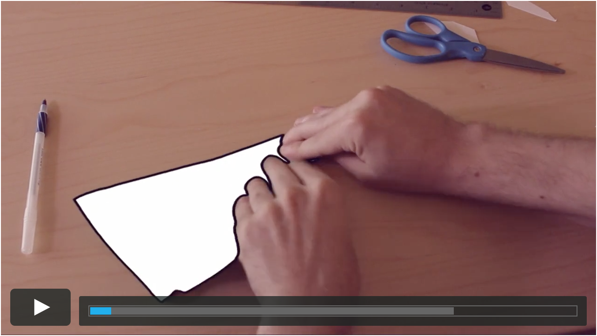

# Player Coding Exercise

Create your own Vimeo Player.



## Requirements

* The play button should trigger play and pause and toggle between the play and pause icons
* The buffer bar should fill to match the loading progress of the video
* The progress bar should fill to match the play progress of the video
* Add support for showing and hiding the controls when you hover on and off of the video

Your source code should use vanilla JavaScript with no third party library dependencies. You may use techniques or features that work only in the latest browsers (for example, you may use transpilers, preprocessors, etc)

### Video URL

`https://player.vimeo.com/external/76979871.hd.mp4?s=700bf8f30f8f8114cc372e94c4156aaf&profile_id=113`

### Sample SVGs
#### Play button

```svg
<svg viewBox="0 0 20 20" preserveAspectRatio="xMidYMid">
    <polygon points="1,0 20,10 1,20" />
</svg>
```

#### Pause button

```svg
<svg viewBox="0 0 20 20" preserveAspectRatio="xMidYMid">
    <rect width="6" height="20" x="0" y="0" />
    <rect width="6" height="20" x="12" y="0" />
</svg>
```

## Bonus

* Add support for scrubbing by clicking and dragging on the progress bar
* Show off your accessibility knowledge
* Keyboard shortcuts
